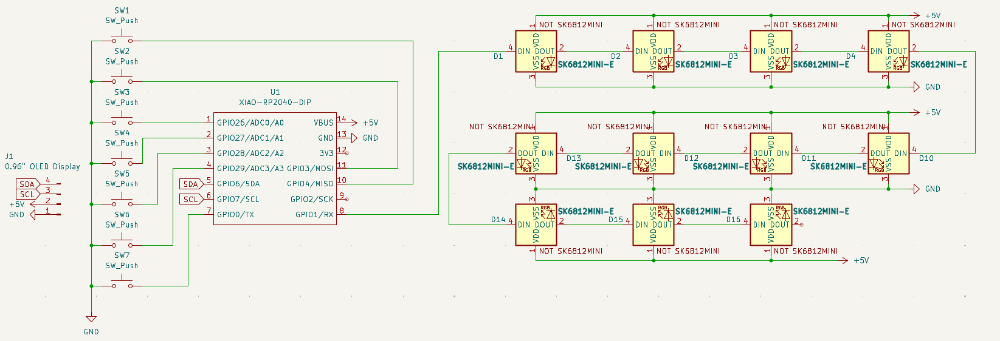
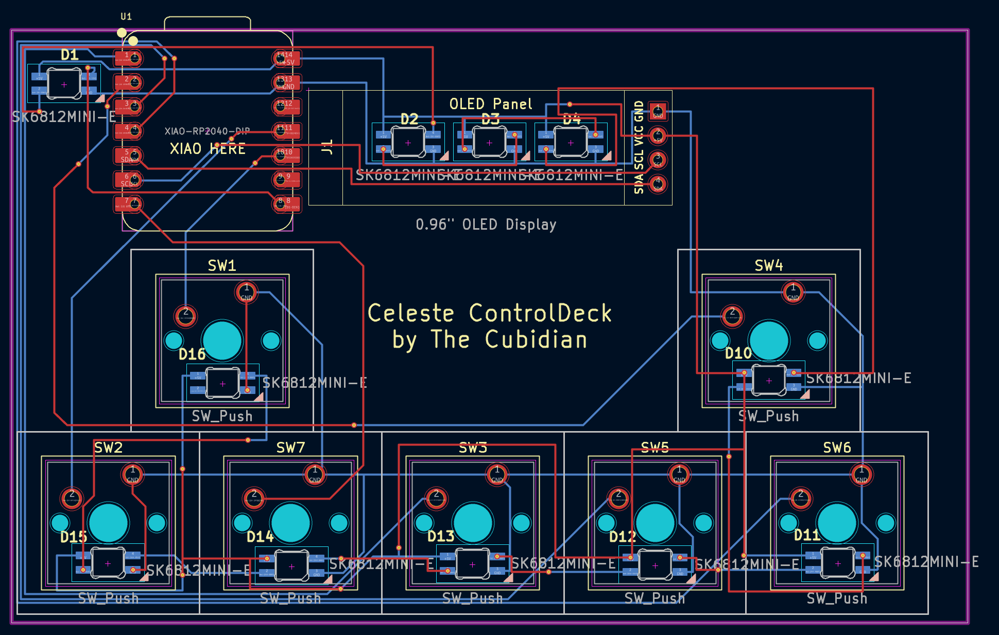
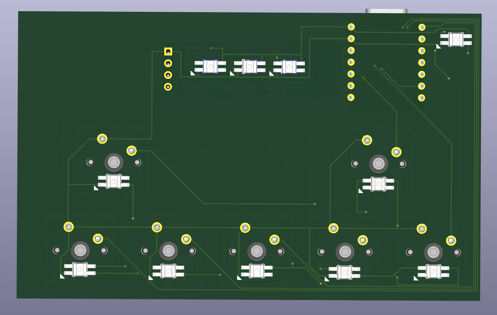
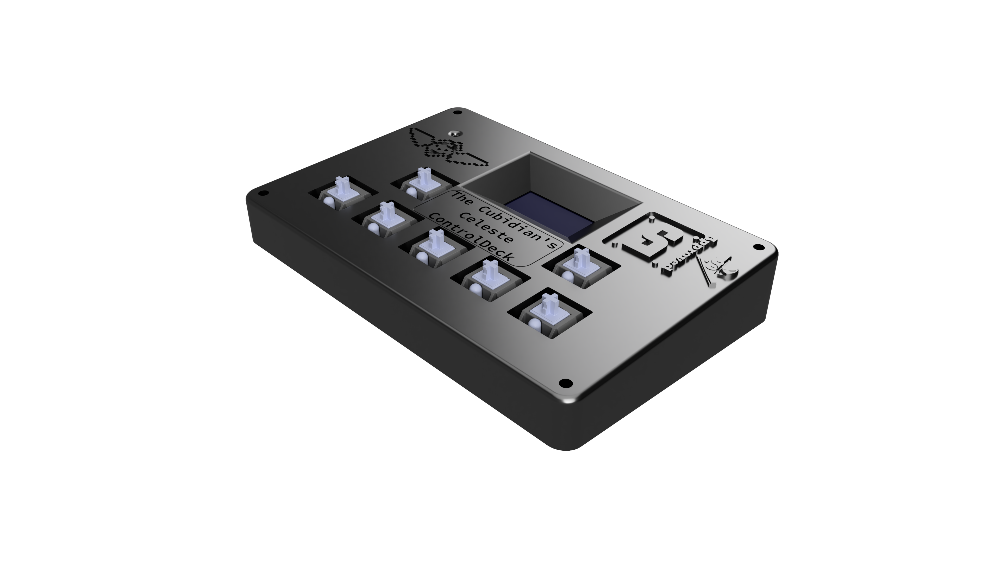
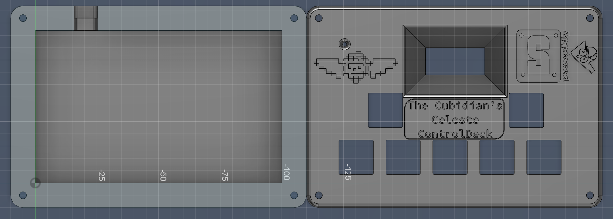

# Celeste-ControlDeck

Did you ever play Celeste with arrow keys? Hated it because those were the default keybinds?
 The Celeste ControlDeck vanquishes this issue, by giving you a dedicated 7 keys to replace those arrow keys,
 and did I mention, you can even use it for other games with the same despicable keybinds?

## BOM
- 8x SK6812MINI-E
- 1x SSD1306 0.91" 128x32 OLED
- 1x Seeed XIAO RP2040
- 7x MX-Style Switches
- 7x White DSA Keycaps

Case composed of Top.step and Bottom.step.

Schematic                  |  PCB                      |  PCB Front Preview              |  PCB Back Preview
:-------------------------:|:-------------------------:|:-------------------------:|:-------------------------:|
  |        |   |  

Assembled Device           |  Case Components
:-------------------------:|:-------------------------:|
    |  
